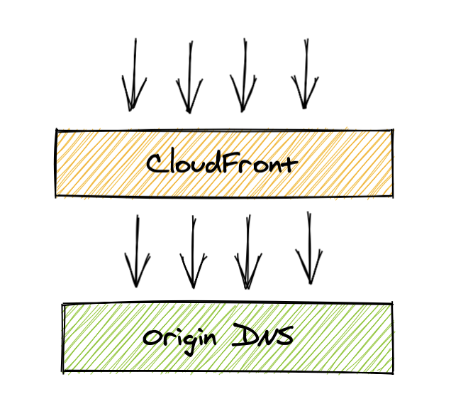
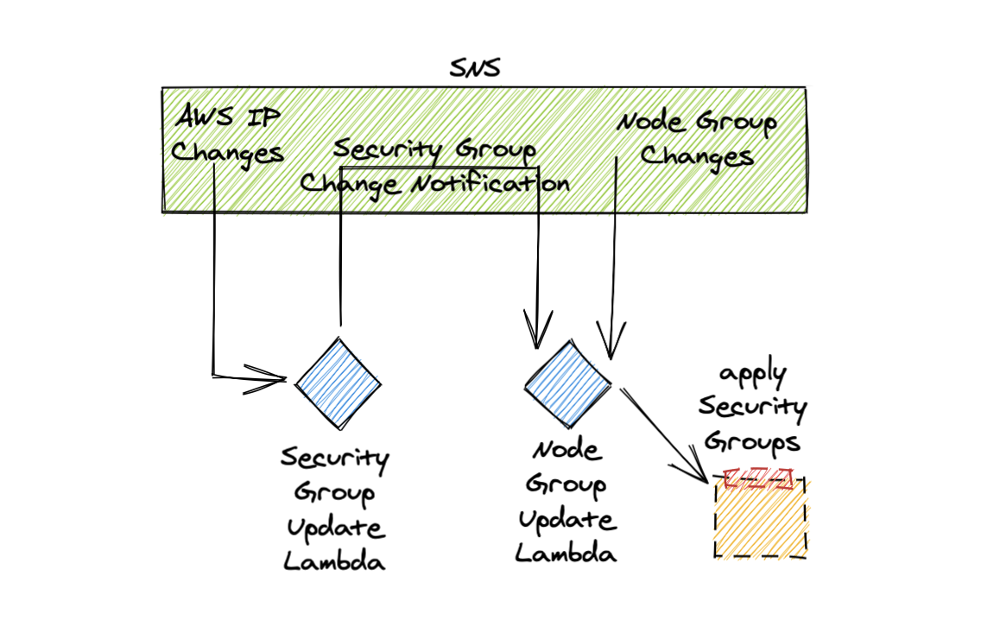
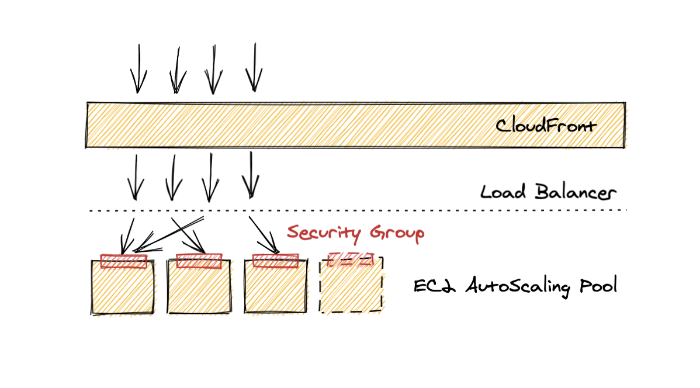

A quick walkthrough on deploying [Ambassador](https://www.getambassador.io) (or
any other [Ingress Controller](https://kubernetes.github.io/ingress-nginx/)) behind WAF filtered
[CloudFront](https://aws.amazon.com/cloudfront/) distribution.

Requirements:
  1. EKS cluster, with [proper configuration](https://docs.aws.amazon.com/eks/latest/userguide/load-balancing.html).
  2. [Helm deployed Ambassador](https://www.getambassador.io/docs/edge-stack/latest/topics/install/helm/).
  3. Working [Terraform](https://www.terraform.io) installation.

Standard way of setuping Load Balancer backed CloudFront Distribution looks like this:



This setup works just fine if you are not concerned about traffic hitting your
Load Balancer directly.

[Here](https://github.com/xytis/proper-ambassador-behind-cloudfront/tree/cloudfront-to-exposed-ambassador)
you can find terraform files that generate CloudFront distribution for listed
Domains. In addition to that, it allows switching between direct access and
CloudFront. Check `locals.tf` file for more details.

Why should you be concerned if your Load Balancer can be reached directly?
Mainly if you deploy WAF on your CloudFront and do some access control through WAF configuration.
Obviously, that is meaningless if there is a way to sidestep your protection.

So what are the available options to remove this vulnerability?

- CloudFront [does not work with Internal Load Balancers as Origins](https://stackoverflow.com/questions/55195852/aws-cloudfront-for-internal-elastic-load-balancer-origin).
- CloudFront [has a dynamic list of IP's, which change randomly](https://docs.aws.amazon.com/AmazonCloudFront/latest/DeveloperGuide/LocationsOfEdgeServers.html). So static security group is not an option.
- Network Load Balancer (which is the preferred way to set up Ambassador) [does not support Security Group attachment directly](https://aws.amazon.com/premiumsupport/knowledge-center/security-group-load-balancer/).
- EKS cluster is composed of Autoscaling Node Pool's which may change dynamically.

Given that, we must:
- Use Internet-facing Network Load Balancer and set up Security Group on backends.
- Bind Ambassador to static Host Ports.
- Setup mechanism for keeping Security Group up to date with CloudFront IP's.
- Setup mechanism for keeping Security Group attached to all EKS Node Pool instances.

Luckily, AWS exposes IP address changes via SNS topic, so we can bind a lambda
to update the Security Group with changed IP's. Also, we can publish Autoscaling
Group changes to our topic. So, we need a few lambdas and all should fall into place:



[Here](https://github.com/xytis/proper-ambassador-behind-cloudfront/tree/lambdas)
you can find terraform files and lambda sources. Check `locals.tf` file for more details.

The end result is an automatically applied dynamic security groups that allow only
traffic from CloudFront to end up in your nodes.



Once you have applied all terraform files and have verified that EKS nodes have correct
Security Group rules, redeploy Ambassador with the following:
```
service:
  loadBalancerSourceRanges:
    - 127.0.0.1/32
```
Above parameter change the autogenerated security group to allow no extra traffic.
Verify that you can reach Ambassador via CloudFront and you can not reach it directly (tcp timeout).
